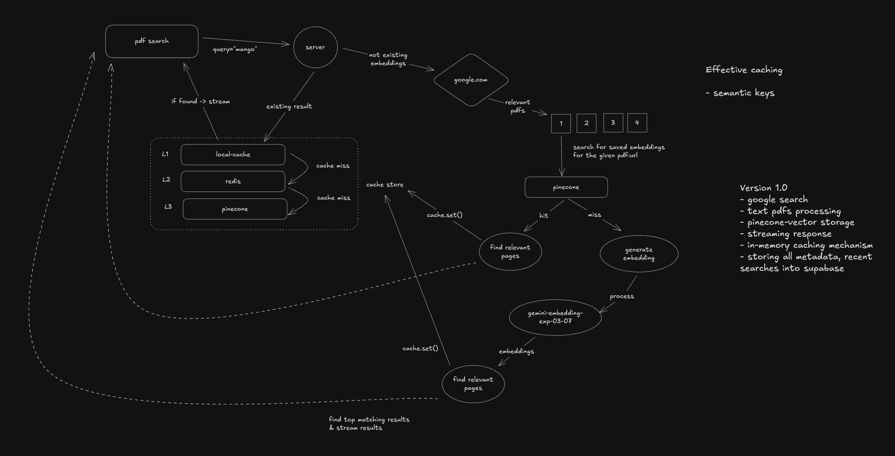

# Run the search service

- Run redis locally - `docker run -d --name redis-stack -p 6379:6379 -p 8001:8001 redis/redis-stack`
- Install dependencies - `pnpm install`
- Run search service - `pnpm run search`
- Type your query

## Features

- Google pdf search
- Paralled pdf processing
- Hybrid vector store - in-memory + pinecone
- Caching with semantic query

### Future Improvements

- OCR workflow
- Streaming responses for more fast experience
- Connection with frontend

# Architecture

Refer to arch.excalidraw

Aim was to

- implement semantic caching to avoid redundant embedding generation for similar queries
- leverage previously computed embeddings and vector representations for efficient retrieval
